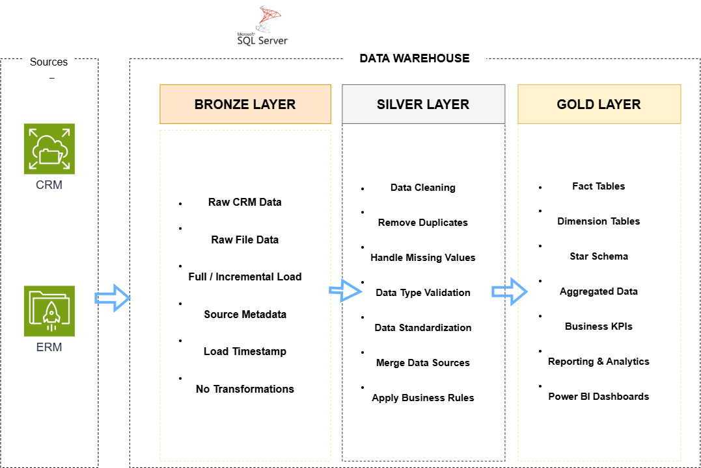
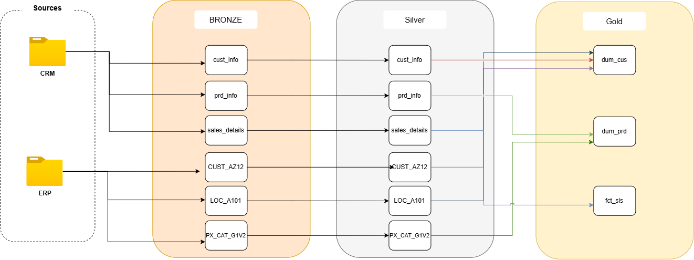

  <h1>🏗️ SQL Server Data Warehouse Project</h1>

  

    <strong>
      Integrating CRM and ERP data using SQL Server
      and Medallion Architecture
    </strong>
  

  

    
    
    
  

<h2>📌 Project Overview</h2>

  This project demonstrates the development of a
  <strong>SQL Server data warehouse</strong> that combines
  customer, product, and sales data from
  <strong>CRM and ERP source files</strong>.

  Data moves through the <strong>Bronze, Silver, and Gold layers</strong>
  to transform raw records into clean, organized data
  for reporting and analysis.

<h3>Objectives</h3>

<ul>
  <li>Collect data from multiple source systems.</li>
  <li>Clean and standardize raw records.</li>
  <li>Integrate customer and product information from CRM and ERP.</li>
  <li>Build a star schema with sales facts and customer and product dimensions.</li>
  <li>Document the data structure and relationships for other developers.</li>
</ul>

  

<h2>🏛️ Data Architecture</h2>

  The project follows <strong>Medallion Architecture</strong>,
  separating raw data, cleaned data, and business-ready data.

<table>
  <tr>
    <th>Layer</th>
    <th>Purpose</th>
  </tr>
  <tr>
    <td>🥉 <strong>Bronze</strong></td>
    <td>
      Stores raw source data before cleaning and transformation.
    </td>
  </tr>
  <tr>
    <td>🥈 <strong>Silver</strong></td>
    <td>
      Cleans and standardizes records, handles missing values,
      and prepares data for integration.
    </td>
  </tr>
  <tr>
    <td>🥇 <strong>Gold</strong></td>
    <td>
      Combines prepared data into dimension and fact views
      designed for business analysis.
    </td>
  </tr>
</table>

  

<h2>🔗 Data Sources &amp; Integration</h2>

  CRM supplies core customer, product, and sales records.
  ERP enriches them with additional customer attributes,
  location information, and product categories.

<table>
  <tr>
    <th>Source</th>
    <th>Dataset</th>
    <th>Description</th>
  </tr>
  <tr>
    <td>CRM</td>
    <td><code>cust_info</code></td>
    <td>Core customer information.</td>
  </tr>
  <tr>
    <td>CRM</td>
    <td><code>prd_info</code></td>
    <td>Core product information.</td>
  </tr>
  <tr>
    <td>CRM</td>
    <td><code>sales_details</code></td>
    <td>Sales records, quantities, prices, and dates.</td>
  </tr>
  <tr>
    <td>ERP</td>
    <td><code>CUST_AZ12</code></td>
    <td>Additional customer attributes.</td>
  </tr>
  <tr>
    <td>ERP</td>
    <td><code>LOC_A101</code></td>
    <td>Customer location information.</td>
  </tr>
  <tr>
    <td>ERP</td>
    <td><code>PX_CAT_G1V2</code></td>
    <td>Product categories and related attributes.</td>
  </tr>
</table>

  

<h2>⭐ Gold Layer — Data Model</h2>

  The Gold layer follows a <strong>Star Schema</strong>.
  A sales fact view connects to customer and product dimension views
  through customer and product keys.

<table>
  <tr>
    <th>View</th>
    <th>Type</th>
    <th>Purpose</th>
  </tr>
  <tr>
    <td><code>goldLayer.dum_cus</code></td>
    <td>Customer Dimension</td>
    <td>
      Combines customer information from CRM
      with ERP customer and location attributes.
    </td>
  </tr>
  <tr>
    <td><code>goldLayer.dum_prd</code></td>
    <td>Product Dimension</td>
    <td>
      Combines product information from CRM
      with ERP category details.
    </td>
  </tr>
  <tr>
    <td><code>goldLayer.fct_sls</code></td>
    <td>Sales Fact</td>
    <td>
      Contains sales line details, dates, quantities,
      prices, and customer and product keys.
    </td>
  </tr>
</table>

  

<h3>Relationships</h3>

<table>
  <tr>
    <th>Dimension Key</th>
    <th>Sales Key</th>
    <th>Relationship</th>
  </tr>
  <tr>
    <td><code>dum_cus.ranking</code></td>
    <td><code>fct_sls.customer_key</code></td>
    <td>One-to-Many</td>
  </tr>
  <tr>
    <td><code>dum_prd.ranking</code></td>
    <td><code>fct_sls.product_key</code></td>
    <td>One-to-Many</td>
  </tr>
</table>

  One customer or product can appear in multiple sales lines.
  These are logical relationships between the Gold views.
  An order number may repeat when an order contains multiple products.

<h2>📖 Data Catalog</h2>

  The data catalog describes the Gold views, their columns,
  data types, and relationships to help team members
  understand and use the model.

  👉 <a href="docs/data_catalog.md">
    <strong>Explore the Data Catalog</strong>
  </a>

<h2>⚙️ Data Processing Workflow</h2>

<ol>
  <li>
    <strong>Load:</strong>
    Import CRM and ERP source files into the Bronze layer.
  </li>
  <li>
    <strong>Clean:</strong>
    Handle duplicates, missing values, and inconsistent formats.
  </li>
  <li>
    <strong>Transform:</strong>
    Standardize values and apply business rules in Silver.
  </li>
  <li>
    <strong>Integrate:</strong>
    Combine related source records into Gold dimensions.
  </li>
  <li>
    <strong>Model:</strong>
    Link sales records to customer and product dimension keys.
  </li>
  <li>
    <strong>Validate:</strong>
    Check key uniqueness, missing matches, and sales calculations.
  </li>
</ol>

<h2>🛠️ Technologies Used</h2>

<table>
  <tr>
    <th>Technology</th>
    <th>Purpose</th>
  </tr>
  <tr>
    <td><strong>SQL Server</strong></td>
    <td>Database and data warehouse implementation.</td>
  </tr>
  <tr>
    <td><strong>T-SQL</strong></td>
    <td>Data loading, transformation, and validation logic.</td>
  </tr>
  <tr>
    <td><strong>SSMS</strong></td>
    <td>Database development and query execution.</td>
  </tr>
  <tr>
    <td><strong>Draw.io</strong></td>
    <td>Architecture, integration, and data-model diagrams.</td>
  </tr>
  <tr>
    <td><strong>Git &amp; GitHub</strong></td>
    <td>Version control and project documentation.</td>
  </tr>
</table>

<h2>📊 Analytics Use Cases</h2>

The Gold layer provides a foundation for analyzing:

<ul>
  <li>Total sales and units sold.</li>
  <li>Sales trends over time.</li>
  <li>Customer purchasing activity.</li>
  <li>Sales by country.</li>
  <li>Product, category, and product-line performance.</li>
</ul>

  The model can be connected to <strong>Power BI</strong>
  or other reporting tools to build dashboards and explore business metrics.

<h2>🌟 About Me</h2>

  Hi! I'm <strong>Yousef Awwad</strong>, a developer interested in
  web development, SQL, and data.

  This project is part of my learning journey in data warehousing:
  loading raw data, improving its quality, and organizing it
  into a model that others can understand and use.

